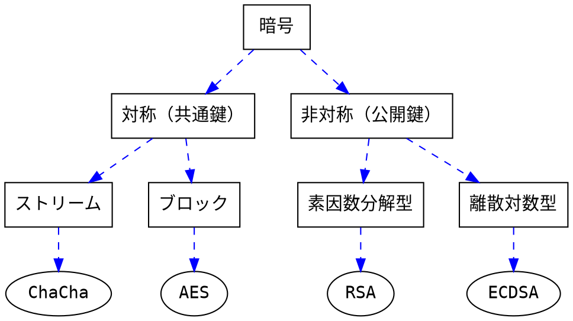

進捗が暗号化されるとつらい季節になって参りました。

算数がわからない、などと言って今まで何ひとつ暗号の勉強をしなかったため、このままではやられてしまった時でも、何をされたのかも分からず倒される噛ませ役にしかなれない。
解説の出来る噛ませ役にランクアップするために、今のうちにちょっと試してみたいと思う。

## 暗号方式
現代暗号の分類としてはこんな感じだろうか。

共通鍵暗号は暗号化と復号に同じ鍵を使う。
そのため、暗号化・復号アルゴリズム、そして鍵生成アルゴリズムの他に、安全な鍵共有方法についても考える必要がある。
ブロック暗号は128bitなどの塊ごと暗号化していくのに対して、ブロックはストリームはbyteなどの単位で逐次暗号化していく。
ストリーム暗号のRC4や、ブロック暗号のTriple DESは名前を聞いたことがあったが、deprecatedになっているらしい。

公開鍵暗号は暗号化に使う鍵と復号に使える鍵とは別になっている。
それゆえに前者は公開しても安全だ。
素数の掛け算は簡単だが、大きな数の素因数分解をして元となった数を探すのは難しい、という性質がRSAのような暗号の原理。
同じ様に、べき乗は簡単だが、大きな数の対数を探すのは難しいという性質がECDSAのような暗号の原理のよう。
(`離散群 説明 簡単` で検索しても簡単な説明は得られなかった。演算をした時に結果が連続的ではない数の集合…?)

## 進捗を暗号化するソフトウェアの場合
### 共通鍵暗号方式のみ
被害者のマシンで鍵を生成、それで進捗を暗号化する方法。
被害者が支払いをしたら、暗号化に使った鍵と同じものを使って解読する。
つまり、マシンには解読に使える鍵が平文で残っていることになるので、被害者にそれが見つかってしまうと、たやすく進捗が取り戻されてしまう。

### 被害者側での公開鍵暗号方式
被害者のマシンで公開鍵・秘密鍵を生成、公開鍵で進捗を暗号化する方法。
その後、秘密鍵を加害者のサーバーに送り、被害者のマシンからは削除するので、被害者は復号が出来ない。
被害者が支払いをしたら、被害者に秘密鍵を送り返してやり、それで復号する。
つまり、インターネット接続が無いと二度と復号出来なくなる。

### 加害者側での公開鍵暗号方式
加害者のマシンで公開鍵・秘密鍵を生成、ハードコードされた公開鍵で進捗を暗号化する方法。
被害者は元から秘密鍵を持っていないので、復号が出来ない。
被害者が支払いをしたら、秘密鍵を被害者のマシンに送りそれで復号する。
ただし、その秘密鍵ひとつで同じ公開鍵で暗号化されたものは全て復号出来るので、無差別感染に成功しても、一人が支払って鍵を公開したら、他の感染者もその鍵で進捗を取り戻せる。
また、インターネット接続の無い端末にある進捗は暗号化出来ない。

### 被害者側で共通鍵&公開鍵、加害者側で公開鍵暗号方式
1. 加害者のマシンで事前に公開鍵・秘密鍵を生成、公開鍵をハードコードしておく。
2. 被害者のマシンで共通鍵を生成、それで進捗を暗号化する。
3. 被害者のマシンで公開鍵・秘密鍵を生成、公開鍵で共通鍵(2)を暗号化する。
4. 加害者の公開鍵(1)で、被害者の秘密鍵(3)を暗号化する。

被害者のマシンには復号するための鍵はあるのだが、それは暗号化されていて、それを復号するための鍵も更に暗号化されているため、復号が出来ない。
被害者が支払いをしたら、暗号化されている被害者の鍵を、加害者のサーバーで復号して送り返してもらう。
それの鍵を使って共通鍵を復号し、その共通鍵で進捗を取り戻すことが出来る。
某泣きたくなるソフトウェアはこの方式を採用。
(被害者の共通鍵を、直接加害者の公開鍵で暗号化しない原理上の理由があるのかは分からなかった。ただ、暗号化するのにかかる時間と暗号の複雑さのトレードオフを考えると方式を組み合わせるメリットは想像できる。)

## つづき
コードを少し書いてみたのですがまた今度ブログに書きます。
